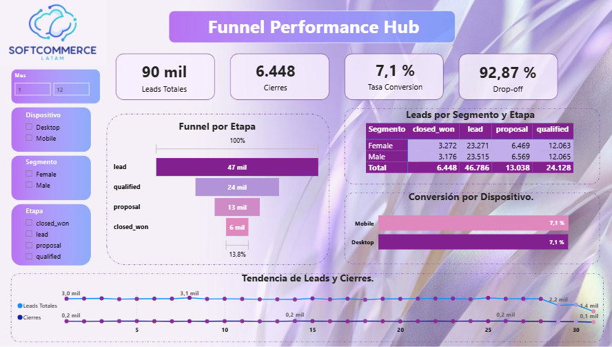

# 📊 Funnel Performance Hub

**Dashboard de análisis de embudo de ventas para identificar puntos de fuga, optimizar la conversión y apoyar decisiones comerciales basadas en datos.**

---

## 🧩 Contexto del negocio
Este proyecto simula una empresa con un modelo de adquisición digital, donde los usuarios avanzan a través de un embudo comercial.

El objetivo es entender:
- Dónde se pierden los usuarios
- Qué canales convierten mejor
- Cómo mejorar el rendimiento comercial

---

## 🎯 Objetivo del análisis
Analizar el embudo de conversión para identificar puntos críticos de abandono, evaluar el desempeño por canal y generar recomendaciones accionables que mejoren la tasa de cierre.

---

## 🛠️ Stack tecnológico
- Excel  
- SQL  
- Python  
- Power BI  

---

## 📸 Dashboard


---

## 🔍 Principales hallazgos
- La mayor fuga de usuarios ocurre en una etapa intermedia del embudo  
- Los canales pagos generan volumen, pero menor conversión  
- Existen segmentos con alto valor no priorizados  
- Se detectan patrones de estacionalidad en la conversión  

---

## 📁 Estructura del repositorio

Estructura del repositorio y organización de los archivos del proyecto:

```text
Funnel-Performance-Hub/
├── assets/
│   └── PowerBIFunnel.PNG
├── data/
│   └── sample_data.csv
├── docs/
│   ├── 01_problema_y_objetivos.md
│   ├── 02_diccionario_de_datos.md
│   ├── 03_metodologia.md
│   └── 04_hallazgos_y_recomenda.md
├── excel/
│   ├── funnel_events.csv
│   └── user_table.csv
├── powerbi/
│   └── dashboard_embudo.pbix
├── python/
│   └── Dashboard_Funnel.ipynb
├── sql/
│   └── dump_schema.sql.sql
└── README.md
```
---

## 📊 Insights clave

A partir del análisis del embudo de conversión, se identificaron los siguientes hallazgos:

- Existe una caída significativa en la etapa de registro a activación, indicando posibles fricciones en el onboarding.
- La tasa de conversión disminuye progresivamente en cada etapa, pero el mayor impacto se concentra en las primeras fases del funnel.
- Algunos segmentos de usuarios presentan mejor rendimiento, lo que sugiere oportunidades de segmentación y personalización.
- El volumen de usuarios en etapas iniciales es alto, pero no se traduce proporcionalmente en conversiones finales.

---

## 💡 Recomendaciones de negocio

Con base en los hallazgos, se proponen las siguientes acciones:

- Optimizar el proceso de onboarding para reducir fricción en la activación de usuarios.
- Implementar pruebas A/B en las primeras etapas del funnel para mejorar la conversión inicial.
- Analizar el comportamiento de los segmentos con mayor conversión para replicar estrategias exitosas.
- Simplificar el flujo de registro y reducir la cantidad de pasos necesarios para completar el proceso.
- Incorporar métricas de seguimiento continuo para monitorear mejoras en la tasa de conversión.

---
## 📈 Impacto esperado

La implementación de estas recomendaciones podría:

- Incrementar la tasa de conversión en etapas críticas del funnel.
- Mejorar la retención temprana de usuarios.
- Aumentar el valor del ciclo de vida del cliente (LTV).
- Generar una toma de decisiones más basada en datos.
