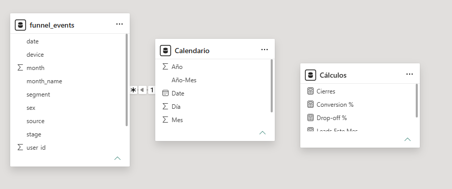

# 📊 Modelo de Datos

Para garantizar una arquitectura escalable, un rendimiento óptimo de las medidas DAX y un filtrado interactivo eficiente, se implementó un modelo de datos basado en un **Esquema en Estrella (Star Schema)**.

## 🧩 Diseño del Modelo de Datos

---

## 📌 Descripción del Modelo

El modelo consta de:

### 🔹 Tabla de Hechos
**funnel_events**
- Contiene el registro granular de interacciones de usuarios.
- Campos:
  - user_id
  - date
  - device (source)
  - sex (segment)
  - stage

---

### 🔹 Tabla de Dimensión
**Calendario**
- Creada dinámicamente en DAX.
- Campos:
  - Año
  - Mes
  - Nombre Mes
  - Año-Mes

- Permite análisis temporal consistente en todo el dashboard.

---

### 🔹 Tabla de Medidas
**Cálculos**
- Contiene exclusivamente KPIs y medidas DAX.
- Mejora la organización y mantenibilidad del modelo.

---

## 🔗 Relaciones (Modelo Dimensional)

- Relación:
  funnel_events[date] → Calendario[Date]

- Cardinalidad:
  Varios a uno (*:1)

- Dirección de filtro:
  Único (Single)

- Descripción:
  La tabla Calendario filtra la tabla de hechos, garantizando consistencia temporal.

---

## 📐 Diccionario de Métricas (DAX)

🟢 Leads Totales: Calcula usuarios únicos en el embudo.

Leads Totales = DISTINCTCOUNT(funnel_events[user_id])

🔵 Cierres: Cuenta conversiones finales.

Cierres = CALCULATE(DISTINCTCOUNT(funnel_events[user_id]), funnel_events[stage] = "closed_won")

🟣 Tasa de Conversión: Mide eficiencia comercial.

Conversion % = DIVIDE([Cierres], [Leads Totales], 0)

🔴 Drop-off %: Mide abandono del funnel.

Drop-off % = 1 - [Conversion %]

🟡 Leads Este Mes: Acumulado mensual (MTD).

Leads Este Mes = CALCULATE(DISTINCTCOUNT(funnel_events[user_id]),DATESMTD(Calendario[Date]))

---

## 📊 Guía de Visualizaciones

🧱 Fila 1: KPIs
- Leads Totales
- Cierres
- Tasa de Conversión
- Drop-off %

🔻 Fila 2: Funnel y Conversión

**Funnel Chart**
- Grupo: stage
- Valores: Leads Totales
- Orden:
  lead → qualified → proposal → closed_won

**Gráfico de Barras**
- Eje Y: source
- Valores: Conversion %
- Título: Conversión por Dispositivo

📈 Fila 3: Tendencia y Segmentación

**Gráfico de Líneas**
- Eje X: year_month
- Valores:
  - Leads Totales
  - Cierres

**Matriz**
- Filas: segment
- Columnas: stage
- Valores: Leads Totales

---

## 🎛️ Filtros Interactivos (Slicers)

| Segmentador | Campo | Estilo | Ubicación |
|------------|------|--------|----------|
| Fecha | Calendario[Date] | Rango | Superior |
| Dispositivo | funnel_events[source] | Lista | Lateral |
| Segmento | funnel_events[segment] | Lista | Lateral |
| Etapa | funnel_events[stage] | Dropdown | Lateral |

---

## 🚀 Conclusión Técnica

El modelo en estrella permite:

- Alto rendimiento en Power BI
- Escalabilidad del modelo
- Claridad en relaciones
- Optimización de medidas DAX
